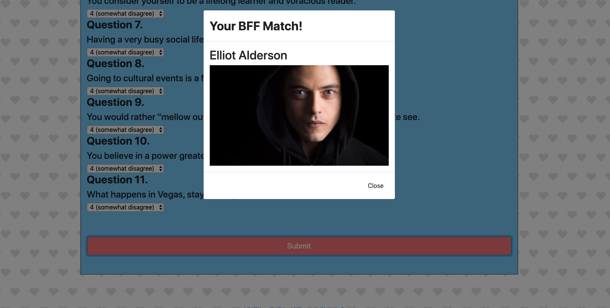

# Friendliest Friend Finder

https://friendliest-friend-finder.herokuapp.com

A compatibility-based Full Stack web application using Node and Express servers

This full-stack site will match the user with their new best friend. The user is prompted to answer an 11 question survey rating their answer on a scale of 1-5. The program compares the users' answers with the friends and  renders the name and image of the friend who's most compatible.

## Building F3: Required tools & tech:

### NPM Packages installed and required by the server.js file:

- Express
- Path
- Body-Parser

### The htmlRoutes.js file contains two routes:

- a GET Route to the survey which displays the survey page once the user clicks the button on the homepage.
- a default, catch-all route that leads the user back to the home page.

### The apiRoutes.js file also contains two routes:

- a GET route with the url /api/friends. This will be used to display a JSON of all possible friends.
- a POST route with the url /api/friends. This will be used to handle incoming survey results and handle the comparison logic

### When the user hits submit:

A modal will pop-up displaying both the name and picture of the closest match. See Demo Below:

##### User arrives at home page and clicks through to survey

##### Closest match to user input pops up in modal

##### Closest match to user input pops up in modal

